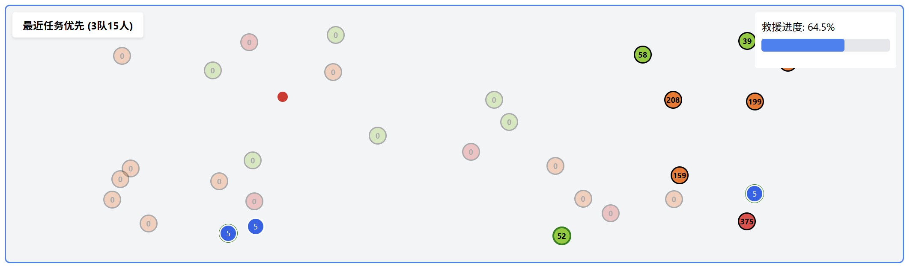
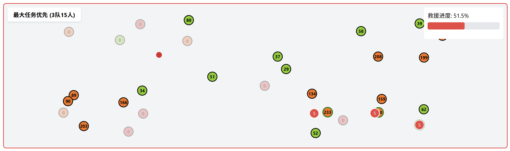
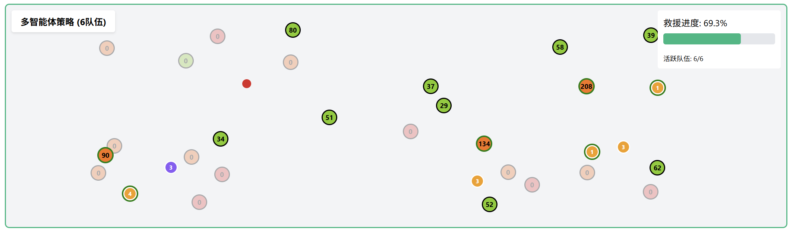

# 灾难救援调度系统

## 一、项目概述
本项目围绕灾难救援调度问题展开，提供了多种算法和策略来优化救援资源的分配，以最大程度地减少受灾人员伤亡。项目中包含了多智能体策略优化（MAPPO）、遗传编程（Genetic Programming）、元启发式调度结合遗传算法优化评分函数，以及不同的救援任务分配策略等多种方法。同时，项目还提供了一个基于 React 的可视化界面，方便用户进行模拟和调试。
多智能体策略通过参数优化可以显著提升救援效率。本系统引入了分区城市地图，各区域具有不同紧急程度特征（南区和西区以高紧急度任务为主，东区以低紧急度任务为主）。多智能体策略的优势在于能够根据任务的紧急程度、位置和人数进行动态决策，并将救援团队分配到不同区域，避免救援资源在单一区域集中。当地图上任务点高度分散时，多智能体策略比单一策略的效率可提升 40-60%，展现出真正的协同救援优势。

## 二、项目结构
```bash
├── public/
│   └── assets/
│       ├── nearest.png
│       ├── largest.png
│       └── multiagnet.png
├── src/
│   ├── App.js
│   ├── mappo.py
│   ├── genetic_programming.py
│   ├── Metaheuristics.py
│   └── distribute_strategy.py
├── package.json
├── package-lock.json
├── README.md
```

## 三、图例说明

在可视化界面中，地图上的不同颜色和救援队伍的数字标识代表着不同的含义：

### 地图区域
| 颜色 | 说明 |
| :--- | :--- |
|  | **高紧急度**：该区域的任务通常具有较高的优先级和紧急性。 |
|  | **中紧急度**：该区域的任务紧急程度适中。 |
|  | **中紧急度**：该区域的任务紧急程度适中。 |
|  | **低紧急度**：该区域的任务紧急程度相对较低。 |

### 救援队伍
| 标识 | 说明 |
| :--- | :--- |
|  | **最近优先队伍**：采用“最近优先”策略进行任务分配的救援队伍。 |
|  | **最大优先队伍**：采用“最大优先”策略进行任务分配的救援队伍。 |
|  | **多智能体 - 最近优先**：多智能体策略中，倾向于“最近优先”分配任务的救援队伍。 |
|  | **多智能体 - 最大优先**：多智能体策略中，倾向于“最大优先”分配任务的救援队伍。 |
|  | **多智能体 - 混合策略**：多智能体策略中，采用混合分配策略的救援队伍。 |

---

## 四、主要模块介绍

### 1. `App.js`
- **功能**：提供一个基于 React 的可视化界面，用于模拟和调试灾难救援调度问题。用户可以选择不同的场景、参数和策略，观察救援过程和结果。
- **核心功能**：
  - 定义了参数空间，包括队伍数量、队伍规模分布、策略比例和混合权重等。
  - 管理多个模拟状态，如最近优先模拟、最大优先模拟和多智能体模拟。
  - 提供了训练模式，用于优化多智能体策略。
  - 实现了可视化界面，包括地图、进度条、按钮和图表等。

### 2. `mappo.py`
- **功能**：实现了多智能体策略优化（MAPPO）算法，用于解决灾难救援任务分配问题。
- **核心类**：
  - `Task`：表示救援任务，包含任务的基本信息，如位置、受灾人数、衰减率等。
  - `RescueGroup`：表示救援小组，包含小组的能力、位置和状态等信息。
  - `EmergencyEnv`：模拟紧急救援环境，提供环境的重置、步骤执行等功能。
  - `Actor` 和 `Critic`：神经网络模型，用于策略和价值评估。
  - `MAPPO`：实现 MAPPO 算法的核心逻辑，包括动作选择、优势估计和网络更新等。

### 3. `genetic_programming.py`
- **功能**：使用遗传编程算法优化救援任务的评分函数。
- **核心类**：
  - `Task`：同 `mappo.py` 中的 `Task` 类。
  - `RescueGroup`：同 `mappo.py` 中的 `RescueGroup` 类，但增加了评分表达式的属性。
  - `ExprNode` 及其子类：用于构建和操作表达式树，实现评分函数的生成和变异。
- **核心函数**：
  - `generate_random_expr`：生成随机表达式树。
  - `mutate`：对表达式树进行变异操作。
  - `crossover`：对表达式树进行交叉操作。

### 4. `Metaheuristics.py`
- **功能**：采用元启发式调度结合遗传算法优化评分函数，考虑了救援任务的完成情况、响应时间、逾期任务数和调度的标准差等因素。
- **核心类**：
  - `Task`：同 `mappo.py` 中的 `Task` 类。
  - `RescueGroup`：同 `mappo.py` 中的 `RescueGroup` 类，但增加了权重属性。
- **核心函数**：
  - `simulate`：模拟救援过程，更新任务和救援小组的状态。
  - `evaluate`：评估救援方案的适应度。
  - `train`：使用遗传算法进行训练，优化权重。
  - `fit_ability_to_weight`：拟合救援小组能力与权重的关系。
  - `test`：测试优化后的救援方案。

### 5. `distribute_strategy.py`
- **功能**：实现了两种不同的救援任务分配策略：最近优先和最大受灾人数优先。
- **核心类**：
  - `Task`：表示救援任务，增加了报告状态和救援衰减率的属性。
  - `Rescuer`：表示救援人员，包含人员的位置、状态和当前任务等信息。
  - `Simulation`：模拟救援场景的基类，提供场景初始化和距离计算等功能。
  - `NearestFirstSimulation`：最近优先分配策略的模拟类。
  - `LargestFirstSimulation`：最大受灾人数优先分配策略的模拟类。

## 五、演示图片

以下是不同救援策略在模拟中的效果演示：

### 1. 最近优先 (Nearest First) 策略


*说明：此图展示了采用“最近优先”策略时的救援队伍分配情况。救援队伍会优先选择距离最近的任务进行救援。*

### 2. 最大优先 (Largest First) 策略


*说明：此图展示了采用“最大受灾人数优先”策略时的救援队伍分配情况。救援队伍会优先选择受灾人数最多的任务进行救援。*

### 3. 多智能体 (Multi-Agent) 策略


*说明：此图展示了采用多智能体策略时的救援队伍分配情况。该策略结合了任务的紧急程度、位置和人数进行动态决策，以达到全局最优。*

## 六、使用方法

### 1. 安装依赖
本项目使用了 `torch`、`numpy`、`matplotlib`、`sklearn`、`react`、`lucide-react` 等库，请确保这些库已经安装。可以使用以下命令进行安装：
```bash
# 安装 Python 依赖
pip install torch numpy matplotlib scikit-learn

# 安装 Node.js / React 依赖
npm install
```

### 2. 运行代码

#### 前端可视化界面
在项目根目录下，运行以下命令启动前端开发服务器：
```bash
npm start
```
打开浏览器，访问 `http://localhost:3000`，即可看到可视化界面。在界面中，你可以选择不同的场景、参数和策略，观察救援过程和结果。

#### Python 算法代码
你也可以直接运行 Python 代码来测试不同的算法和策略。例如，运行 `Metaheuristics.py` 进行元启发式调度训练：
```bash
python src/Metaheuristics.py
```

## 七、注意事项
- 本项目中的代码可以根据实际需求进行扩展和修改，例如调整算法参数、增加新的救援策略等。
- 在运行代码时，请确保输入的参数合理，避免出现异常情况。
- 部分代码中使用了随机数生成，可能会导致每次运行结果略有不同。如果需要可重复的结果，可以设置随机数种子。